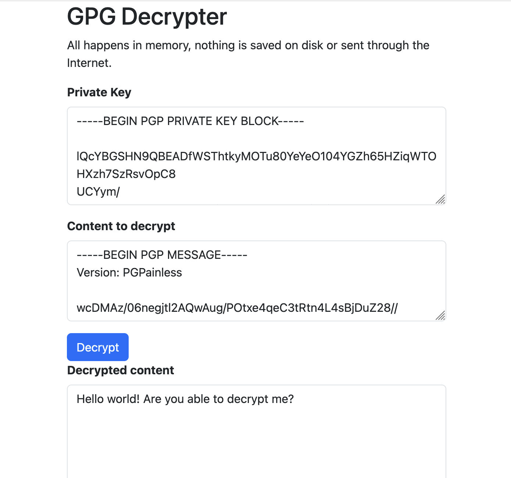

# PGP Strings Decrypter

Easily decrypt PGP-encrypted strings right inside a static web page. 

Clone this repository to your local machine and decrypt any PGP-encrypted text 
directly in your browser—securely, in memory, and without transmitting any data over the Internet.

It’s useful for me; maybe it’ll be useful for you too.

